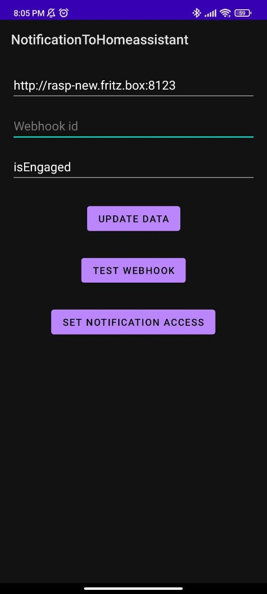

Mobile Alarm -> Home Assistant
==============================

This android app listens for a Notification from the android alarm clock until an alarm clock rings, at which point it will send a request to a user-supplied webhook. Once started, it will run indefinitely and act on every alarm. 

I created this to fix my sleep schedule by making sure every smart device in my room turns on and will only turn off once I reach the other side of my room where an nfc tag is waiting to be scanned.

This works via the [HomeAssistant template feature](https://www.home-assistant.io/integrations/template/), which sets up a "dummy" sensor which can be altered with various triggers, including a webhook.

With the dummy sensor set-up, you are able to create automations triggered by this alarm event as usual.
